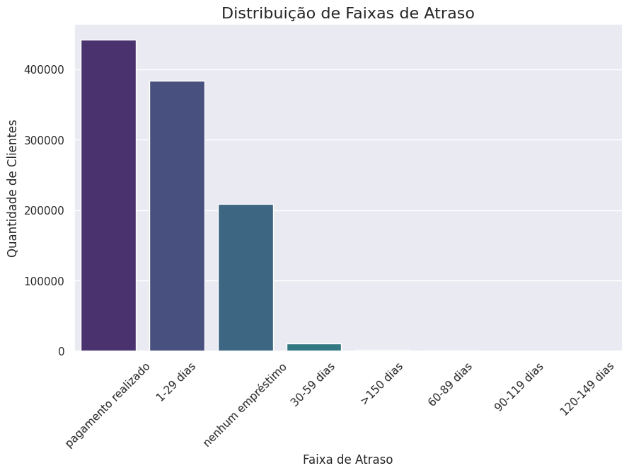
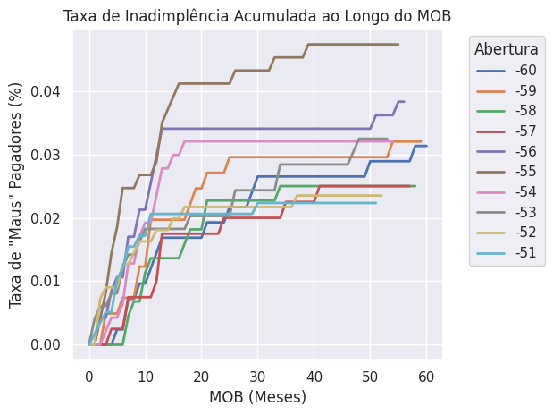

# 🏦 Análise de Risco de Crédito — Modelagem Preditiva de Inadimplência
 
> **Pipeline end-to-end de Machine Learning** para classificação de risco em concessão de crédito bancário, com aplicação interativa em Streamlit. A metodologia aplicada aqui — detecção de padrões comportamentais, tratamento de desbalanceamento e otimização do tradeoff falso positivo × falso negativo — é diretamente transferível a problemas de **prevenção a fraudes** e **detecção de anomalias** em ambientes financeiros.
 


 
---
 
## 🎯 Problema de Negócio
 
Instituições financeiras perdem bilhões anualmente com inadimplência. O desafio real não é apenas identificar maus pagadores — é **minimizar falsos positivos** (bloquear clientes bons) sem deixar passar falsos negativos (liberar crédito para quem não vai pagar). Um bloqueio indevido tem custo direto: perda de receita, impacto na experiência do usuário e dano à reputação.
 
**Objetivo:** construir um modelo preditivo que classifique clientes como bons ou maus pagadores, com controle explícito do tradeoff entre precisão e recall, e com resultado acessível via interface web.
 
---
 
## 🗂️ Estrutura do Projeto
 
```
analise_de_credito_bancario/
│
├── notebooks/               # Análise exploratória, feature engineering e modelagem
├── Dados/                   # Datasets originais
├── obj/                     # Artefatos serializados: modelo, features, lista de campos
├── img/                     # Visualizações geradas
├── simular_credito.py       # Aplicação Streamlit para simulação em tempo real
├── utils.py                 # Transformador customizado (compatível com sklearn Pipeline)
└── requirements.txt
```
 
---
 
## 🔬 Metodologia
 
### 1. Limpeza e Preparação dos Dados
 
- Remoção de duplicatas e tratamento de valores inconsistentes (ex.: `Anos_empregado = -1000.7` → marcação de pensionistas)
- Tratamento de outliers em `Rendimento_Anual` (valores acima de R$ 700.000 removidos)
- Codificação de variáveis categóricas com `OneHotEncoder`
- Normalização de variáveis contínuas com `MinMaxScaler`
### 2. Tratamento de Desbalanceamento
 
O dataset apresenta desbalanceamento severo entre bons e maus pagadores — padrão típico em problemas de risco financeiro e detecção de fraude. Foi utilizado **SMOTE (Synthetic Minority Oversampling Technique)** para gerar amostras sintéticas da classe minoritária e garantir que os modelos aprendessem os padrões de risco reais.
 
### 3. Feature Engineering
 
- Criação de variável derivada de estabilidade de emprego
- Análise Vintage (MOB — Months on Books): rastreamento da taxa de inadimplência por coorte de concessão
- Transformador customizado encapsulado em classe compatível com `sklearn.Pipeline` para reproducibilidade
### 4. Modelos Avaliados
 
| Modelo | AUC | Precisão | Recall | KS |
|---|---|---|---|---|
| **Random Forest** | **0.83** | **98%** | **36%** | **0.97** |
| Decision Tree | 0.75 | 97% | 37% | 0.94 |
| KNN | 0.71 | 90% | 45% | 0.81 |
| Logistic Regression | 0.58 | 55% | 58% | 0.13 |
 
---
 
## ⚖️ Tradeoff Falso Positivo × Falso Negativo
 
O modelo campeão (Random Forest) apresenta **recall de 36%** com **precisão de 98%** no threshold padrão de 0.5 — uma escolha deliberada para este contexto.
 
**Por quê?**
 
Em concessão de crédito, um **falso positivo** (negar crédito a um bom pagador) tem custo real: perda de receita, impacto na experiência do cliente e potencial churn. Já um **falso negativo** (aprovar um mau pagador) gera perda financeira direta. O threshold foi mantido conservador (alta precisão) porque o custo de negócio de um bloqueio indevido foi avaliado como comparável ao custo de uma inadimplência em carteiras de menor ticket.
 
Para contextos de maior tolerância ao risco (ex.: fraude de alto impacto), o threshold pode ser reduzido para ~0.3, elevando o recall para ~65% com queda de precisão para ~85% — decisão que deve ser calibrada com a área de negócio.
 
O **KS de 0.97** confirma que o modelo separa muito bem as duas populações, mesmo com recall aparentemente baixo no threshold padrão.
 
---
 
## 📊 Principais Insights
 
### Distribuição de Pagamentos em Atraso
 
A maior concentração de atrasos está na faixa de **1–29 dias** (37% dos clientes), sugerindo que **intervenções precoces** — alertas automáticos antes dos 30 dias — têm alto potencial de recuperação.
 

 
### Análise Vintage (MOB)
 
Clientes com mais de 10 meses de relacionamento (MOB > 10) apresentaram aumento expressivo na taxa de inadimplência — indicando necessidade de reavaliação periódica de risco, não apenas no momento da concessão.
 

 
---
 
## 🖥️ Aplicação Interativa (Streamlit)
 
O modelo treinado foi serializado com `joblib` e integrado a uma aplicação web que permite simular a decisão de crédito em tempo real, preenchendo variáveis do cliente (ocupação, renda, histórico de emprego, perfil familiar).
 
```bash
# Instalar dependências
pip install -r requirements.txt
 
# Rodar a aplicação
streamlit run simular_credito.py
```
 
> 💡 **Screenshot:** _[adicione aqui um GIF ou imagem da interface Streamlit rodando]_
 
---
 
## 🚀 Próximos Passos / Arquitetura de Produção Proposta
 
Para levar este modelo a um ambiente produtivo real, a arquitetura planejada é:
 
```
[Fonte de dados] → [Feature Store] → [Modelo servido via FastAPI]
                                              ↓
                                    [Monitoramento de drift]
                                    (Evidently AI / custom)
                                              ↓
                                    [Alerta de re-treino]
                                    + CI/CD com GitHub Actions
```
 
- **API REST** com FastAPI para servir predições em tempo real
- **Monitoramento de data drift** e degradação de performance em produção (Evidently AI)
- **Pipeline de re-treino automático** via GitHub Actions quando KS cair abaixo de threshold definido
- **Versionamento de modelos** com MLflow
---
 
## 🛠️ Stack
 
`Python` · `Scikit-Learn` · `imbalanced-learn (SMOTE)` · `Pandas` · `NumPy` · `Streamlit` · `Joblib` · `Matplotlib` · `Seaborn`
 
---
 
## 👤 Autor
 
**Nimer Hammad**
[LinkedIn](https://www.linkedin.com/in/hammad-nimer/) · [GitHub](https://github.com/HammadN98)
